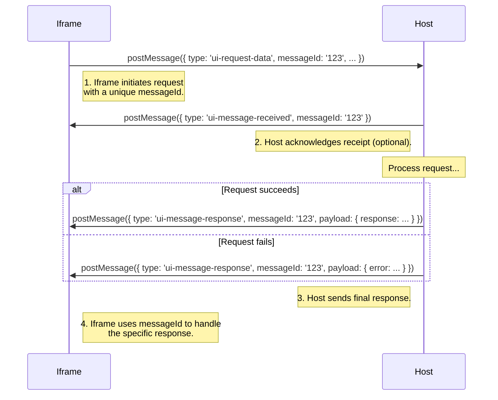

# Embeddable UI

> This document describes the general communication protocol for any embeddable UIs.
> This is implemented by the mcp-ui iframe based solution, in the context of UI over MCP.

# Concepts

- Embedded iframes communicate with the parent window via `postMessage`.
- The parent window can send messages to the iframe.
- The iframe can send messages to the parent window.

# Communication Protocol

## Message Structure

```typescript
type Message = {
  type: string;
  messageId?: string; // optional, used for tracking the message
  payload: Record<string, unknown>;
};
```

## Message Types

- [`intent`](#intent) - the user has interacted with the UI and expressed an intent, and the host should act on it
- [`notify`](#notify) - the iframe already acted upon the user interaction, and is notifying the host to trigger any side effects
- [`prompt`](#prompt) - the iframe asks the host to run a prompt
- [`tool`](#tool) - the iframe asks the host to run a tool call
- [`link`](#link) - the iframe asks the host to navigate to a link

### `intent`

- indicates that the user has interacted with the UI and expressed an intent, and the host should act on it
- the payload is an object with the following properties:
  - `intent` - the intent that the user expressed
  - `params` - the parameters to pass to the intent

**Example:**

```typescript
window.parent.postMessage(
  {
    type: "intent",
    payload: {
      intent: "create-task",
      params: {
        title: "Buy groceries",
        description: "Buy groceries for the week",
      },
    },
  },
  "*"
);
```

### `notify`

- indicates that the iframe already acted upon the user interaction, and is notifying the host to trigger any side effects
- the payload is an object with the following properties:
  - `message` - the message to notify the host with

**Example:**

```typescript
window.parent.postMessage(
  {
    type: "notify",
    payload: {
      message: "cart-updated",
    },
  },
  "*"
);
```

### `prompt`

- indicates that the iframe asks the host to run a prompt
- the payload is an object with the following properties:
  - `prompt` - the prompt to run

**Example:**

```typescript
window.parent.postMessage(
  {
    type: "prompt",
    payload: {
      prompt: "What is the weather in Tokyo?",
    },
  },
  "*"
);
```

### `tool`

- indicates that the iframe asks the host to run a tool call
- the payload is an object with the following properties:
  - `toolName` - the name of the tool to run
  - `params` - the parameters to pass to the tool

**Example:**

```typescript
window.parent.postMessage(
  {
    type: "tool",
    payload: {
      toolName: "get-weather",
      params: {
        city: "Tokyo",
      },
    },
  },
  "*"
);
```

### `link`

- indicates that the iframe asks the host to navigate to a link
- the payload is an object with the following properties:
  - `url` - the URL to navigate to

**Example:**

```typescript
window.parent.postMessage(
  {
    type: "link",
    payload: {
      url: "https://www.google.com",
    },
  },
  "*"
);
```

## Reserved Message Types (iframe to host)

- [`ui-lifecycle-iframe-ready`](#ui-lifecycle-iframe-ready) - the iframe is ready to receive messages
- [`ui-size-change`](#ui-size-change) - the iframe's size has changed and the host should adjust the iframe's size
- [`ui-request-data`](#ui-request-data) - the iframe sends a request to the host to request data
- [`ui-request-render-data`](#ui-request-render-data) - the iframe requests render data from the host

### `ui-lifecycle-iframe-ready`

- indicates that the iframe is ready to receive messages

**Example:**
See [Render Data](#passing-render-data-to-the-iframe)

### `ui-size-change`

- indicates that the iframe's size has changed and the host should adjust the iframe's size
- the payload is an object with the following properties:
  - `width` - the new width of the iframe
  - `height` - the new height of the iframe

**Example:**

```typescript
const resizeObserver = new ResizeObserver((entries) => {
  entries.forEach((entry) => {
    window.parent.postMessage(
      {
        type: "ui-size-change",
        payload: {
          height: entry.contentRect.height,
        },
      },
      "*"
    );
  });
});

resizeObserver.observe(document.documentElement);
```

### `ui-request-data`

- a message that the iframe sends to the host to request data. The message must include a `messageId` to allow the iframe to track the response.
- the payload is an object with the following properties:
  - `requestType` - the type of the request
  - `params` - the parameters to pass to the request

**Example:**

```typescript
window.parent.postMessage(
  {
    type: "ui-request-data",
    messageId: "123",
    payload: {
      requestType: "get-payment-methods",
      params: {
        // any params needed for the request
      },
    },
  },
  "*"
);
```

See also [Asynchronous Data Requests with Message IDs](#asynchronous-data-requests-with-message-ids)

### `ui-request-render-data`

- a message that the iframe sends to the host to request render data. The message can optionally include a `messageId` to allow the iframe to track the response.
- this message has no payload
- the host responds with a [`ui-lifecycle-iframe-render-data`](#ui-lifecycle-iframe-render-data) message containing the render data

**Example:**

```typescript
window.parent.postMessage(
  {
    type: "ui-request-render-data",
    messageId: "render-data-123", // optional
  },
  "*"
);
```

## Reserved Message Types (host to iframe)

- [`ui-lifecycle-iframe-render-data`](#ui-lifecycle-iframe-render-data) - the host sends the iframe render data
- [`ui-message-received`](#ui-message-received) - the host sends the iframe to indicate that the action has been received
- [`ui-message-response`](#ui-message-response) - the iframe sends the host to indicate that the action has been processed or failed

### `ui-lifecycle-iframe-render-data`

- a message that the host sends to the iframe to pass any relevant render data
- the payload is an object with the following properties:
  - `renderData` - the render data to pass to the iframe

**Example:**
See [Render Data](#render-data)

### `ui-message-received`

- a message that the host sends to the iframe to indicate that the action has been received. The original messageId is passed back to the host to allow the host to track the action. This is useful for `request-data` messages, but is not limited to this type.
  **Example:**
  See [Asynchronous Data Requests with Message IDs](#asynchronous-data-requests-with-message-ids)

### `ui-message-response`

- a message that the iframe sends to the host to indicate that the action has been processed. The original messageId is passed back to the host to allow the host to track the action. This is useful for `request-data` messages, but is not limited to this type.
- the payload is an object with the following properties:
  - `response` - the response to the action
  - `error` - the error, if any, that occurred

**Example:**
See [Asynchronous Data Requests with Message IDs](#asynchronous-data-requests-with-message-ids)

## Query Parameters

### `waitForRenderData`

- a query parameter that can be passed to the iframe to indicate that the iframe should wait for the render data to be passed before sending any messages
- the value of the query parameter is a boolean
- if the query parameter is present, the iframe will wait for the render data to be passed before sending any messages

**Example:**
See [Render Data](#render-data)

# Usage Examples

## Passing Render Data to the Iframe

### In the host:

```typescript
iframeSrc = "https://my-embeddable-ui.com?waitForRenderData=true";
iframe = document.createElement("iframe");
iframe.src = iframeSrc; // the iframe will wait for the render data to be passed before rendering
document.body.appendChild(iframe);

window.addEventListener("message", (event) => {
  if (event.data.type === "ui-lifecycle-iframe-ready") {
    iframe.contentWindow.postMessage(
      {
        type: "ui-lifecycle-iframe-render-data",
        payload: { renderData: { theme: "dark" } },
      },
      "*"
    );
  }
});
```

### In the iframe:

```typescript
// In the iframe's script
const urlParams = new URLSearchParams(window.location.search);
if (urlParams.get("waitForRenderData") === "true") {
  let customRenderData = null;

  // The parent will send this message on load or when we notify it we're ready
  window.addEventListener("message", (event) => {
    // Add origin checks for security
    if (event.data.type === "ui-lifecycle-iframe-render-data") {
      // If the iframe has already received data, we don't need to do anything
      if (customRenderData) {
        return;
      } else {
        customRenderData = event.data.payload.renderData;
        // Now you can render the UI with the received data
        renderUI(customRenderData);
      }
    }
  });
  // We can let the parent know we're ready to receive data
  window.parent.postMessage({ type: "ui-lifecycle-iframe-ready" }, "*");
} else {
  // If the iframe doesn't need to wait for data, we can render the default UI immediately
  renderUI();
}
```

### Alternative: Requesting Render Data On-Demand

Instead of relying on the `ui-lifecycle-iframe-ready` lifecycle event, you can explicitly request render data when needed using `ui-request-render-data`:

#### In the iframe:

```typescript
// Request render data when ready
async function requestRenderData() {
  return new Promise((resolve, reject) => {
    const messageId = crypto.randomUUID();
    
    window.parent.postMessage(
      { type: "ui-request-render-data", messageId },
      "*"
    );

    function handleMessage(event) {
      if (event.data?.type !== "ui-lifecycle-iframe-render-data") return;
      if (event.data.messageId !== messageId) return;
      
      window.removeEventListener("message", handleMessage);
      
      const { renderData, error } = event.data.payload;
      if (error) return reject(error);
      return resolve(renderData);
    }

    window.addEventListener("message", handleMessage);
  });
}

// Use it when your iframe is ready
const renderData = await requestRenderData();
renderUI(renderData);
```

## Asynchronous Data Requests with Message IDs

Actions initiated from the iframe are handled by the host asynchronously (e.g., data requests, tool calls, etc.). It's useful for the iframe to get feedback on the status of the request and its result. This is achieved using a `messageId` to track the request through its lifecycle. Example use cases include fetching additional information, displaying a progress bar in the iframe, signaling success or failure, and more.

The primary message types are:
- `ui-request-data`: Sent from the iframe to the host to request some data or action.
- `ui-message-received`: Sent from the host to the iframe to acknowledge that the request is being processed.
- `ui-message-response`: Sent from the host to the iframe with the final result (success or error).

While this example uses `ui-request-data`, any message from the iframe can include a `messageId` to leverage this asynchronous flow (e.g., `tool`, `intent`).


